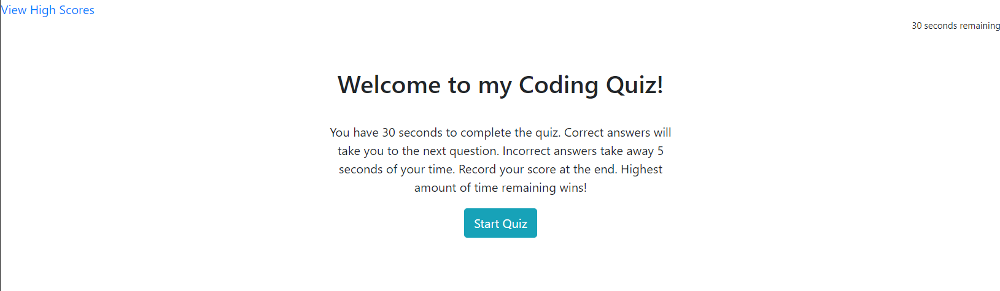

# Code Quiz

Test your knowledge of coding languages! Can you beat the clock?

## Table of Contents

1. [Usage](#Usage)
1. [Languages and Concepts](#Languages-and-Concepts)
1. [Method](#Method)
1. [Demo](#Demo)
1. [Roadmap](#Roadmap)
1. [Links](#Links)
1. [Contact](#Contact)
1. [Contributing](#Contributing)
1. [License](#License)

## Usage

Practice your knowledge of coding languages, concepts and history to help strengthen your understanding of this complex world of computer languages.

## Languages and Concepts

- HTML5
- CSS
- JavaScript
- localStorage
- Bootstrap

## Method

With this being a larger project compared to what I've done in the past, I decided to take baby steps and tried to keep that idea in mind as I worked through, trying to keep my mind on one problem at a time, while making a list of all the other things I'd think of along the way.

1. To begin this project, I first started by making each of the pages I would need : 2 HTML pages, 1 JavaScript page and 1 CSS page.
1. Next I wrote out the initial pseudocode with the steps I would need to create the HTML pages, adding in tags to hold the questions and timer on the index page, creating a timer and game over function on the js file, and linked all the pages.
1. Next I added in the Start Quiz button and the eventListener for the button clicks to start the timer. I added in a prompt to collect user initials when the timer runs out (to use as a testing device) and an input form for the user to input their initials at the end. Then I began writing the function to display the first question.
1. Next I created an array of objects to hold the questions, multiple choice options and the answer.
1. Then I finished the displayQuestion function so that the first question would display on the screen when the start quiz button was clicked, which would also trigger the timer to start counting down.
1. Now to get a better visual on what I was looking at and how it was coming together, I added some welcome text to greet the user and explain the game and also some styling to get everything in place, which would then later help with the addEventListeners when clicking on an answer.
1. For the next step, I added an eventListener for mouse clicks on the multipleChoice. Then I added an event.target.textContent to register which was the correct answer.
1. Now to get it displaying the next question, I added an if statement for if answer is true, then the next question will display and added a questionCounter to keep track of which question it is on. Then to finish off the basic functionality of the quiz, I added some code to hide the initial form until time runs out. When the time runs out, it's game over and the initial form input is displayed.
1. Now that the quiz is functioning, it was time to start adding in the details. My next step was to have it recognize an incorrect answer by using an else statement and having it subtract 5 seconds from the clock. Then I also added a submit button to the initials input.
1. My next step was to get the quiz to end if the user gets through the questions before the time runs out (which is the way to score). For this, I added if statements to end the questions and to go to the game over screen when the questions run out. Here I made sure my pseudocode and comments were descriptive to explain what was going on throughout my code.
1. Next I added an event listener to the submit button so the initials would be stored in localStorage. I also added an error message in case the user did not input initials.
1. Since the initials are now storing, I had the time aka score to store along with it.
1. Now that I am on the other HTML page, I started getting several errors in the console.log for variables/elements it did not recognize, and thus not rendering the page. After some research, I found that I could add if statements and if the variable/element was false, it would skip it. Problem Solved! Then I added functionality to the submit button, so once it's clicked, it will take you to the high scores page. Here I started an ordered list and added a return to quiz link so the user can navigate back to the home page.
1. The next thing I noticed was that the timer had the potential to go beyond 0, and if it did, it would just keep going. I adjusted the if secondsLeft statement to account for this issue. I then added some code to pull the information from the localStorage and display it on the high scores page.
1. Now that I have a working quiz and a score on the board, I added functionality to the reset button so it would clear the board.
1. So now the quiz is recording one score, but it needs to hold multiple. For this I reorganized the scoreStorage function: moved the array outside the function, then had the function push the initials/score objects into an array, adding to it each time. Then I added a for loop to take each object and create a list item and append it to the high scores list element. Next I added a sort function so it would sort the scores highest to lowest. I then turned the return to quiz link into a button.
1. Now the quiz is finished...almost. I go through the quiz from different points looking for errors. I find that if the high scores page starts out empty, the return to quiz button isn't working. After a few tries, I was able to get it working.
1. Lastly I made my multiple choice display into a for loop and fixed the clear high scores function to show the same when starting as null or being reset. I reorganized my js file to have variables on top, then functions and eventListeners at the bottom.
1. And finally I added some styling using the Bootstrap CSS Framework.

## Demo

## Roadmap

To advance this project, I would like to incorporate more questions of varying difficulty, perhaps giving the user the ability to choose different modes of easy, medium, hard and random. I could also add in a shuffle feature so the questions aren't in the same order every time, and then start adding in true/false or input questions. Eventually I would like to have different quizzes for the different languages, again either mixing or giving the user the ability to choose.

## Links

- [Project Repository](https://github.com/ncmarsh/4_code_quiz) 
- [Code Quiz](https://ncmarsh.github.io/4_code_quiz/)

## Contact

- Nicole Marshall - [@ncmarsh](https://github.com/ncmarsh)

## Contributing

This is a personal project; no contributions are required at this time.

## License

No license granted.

##### [Return to Top of Page](#Code-Quiz)